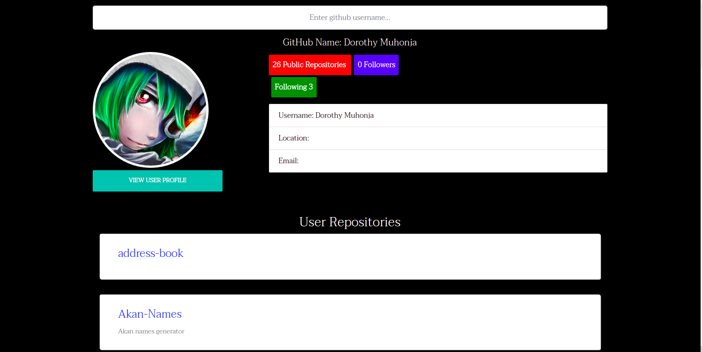

# Quotes
### By Dorothy Muhonja

This project was generated with [Angular CLI](https://github.com/angular/angular-cli) version 11.1.1.

## Description
This is an app where a user can search for github profiles and repositories.

# set up instructions
### Requirements
* Code editor ie Visual Studio/Atom Notepad etc
* Angular cli (latest version)
* Node 
* Latest web browser

# How to run
* Click on this [Link](https://github.com/dorothymuhonja/Github-search-angular.git) to access my git hub Github search repositpory.
* Fork the repo or clone the project to your local machine
* Click this [link]() to view the live page

### Development server

Run `ng serve` for a dev server. Navigate to `http://localhost:4200/`. The app will automatically reload if you change any of the source files.

## BDD(Behavior Driven Development)
* User enters the name of the github user through the input form and it automatically searches the name

# Technologies Used
* Angular
* Typescript
* html
* css
* bootstrap

## Page Screenshots

 

## Contact information
Email: dorothymuhonja7@gmail.com

## License and Copyright
Copyright (c) 2021 Dorothy Muhonja

[MIT License](LICENSE)

